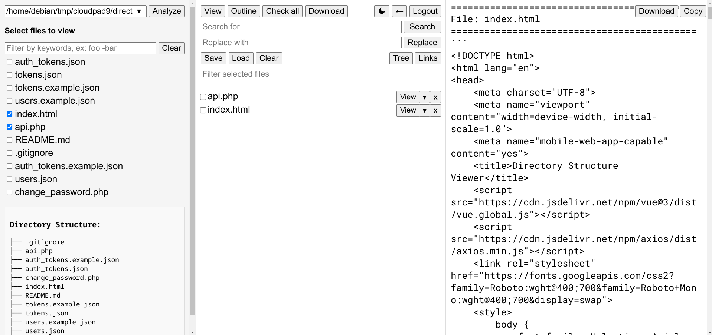

# Directory Structure Viewer

Explore repositories, select files, and copy code context for AI agents in seconds. Install with one command, no web server needed.


<p align="center">
  
</p>

A lightweight **web-based tool for exploring directory structures across multiple repositories** and quickly extracting file contents for development workflows.

Especially useful when working with **AI coding assistants**, allowing developers to quickly browse a project, select relevant files, and copy their contents into prompts.

Built with **Python / FastAPI (backend)** and **Vue.js (frontend)**.
Designed to be **self-hosted, simple, and fast**.

> This is a Python rewrite of the [original PHP version](https://github.com/cloudpad9/directory-structure-viewer). Same features, much simpler installation.

---

# Install

```bash
curl -fsSL https://raw.githubusercontent.com/cloudpad9/directory-structure-viewer-python/main/install.sh | bash
```

This creates a self-contained installation at `~/.dsviewer/` with its own Python virtual environment. No `sudo` required.

The installer will prompt you to create an admin username and password on first install.

Then open a new terminal (or `source ~/.bashrc`) and run:

```bash
dsviewer
```

The app starts at **http://localhost:9876**.

---

# Update

To update to the latest version, run either of the following from any terminal on the machine:

```bash
dsviewer --update
```

Or directly with curl:

```bash
curl -fsSL https://raw.githubusercontent.com/cloudpad9/directory-structure-viewer-python/main/update.sh | bash
```

The update script replaces only the application code — your data directory (`~/.dsviewer/data/`) and credentials are preserved. If a systemd service is running, it is stopped before the update and restarted automatically afterward.

---

# Requirements

Python 3.10 or newer. No web server, no database, no PHP.

Check your Python version:

```bash
python3 --version
```

---

# Usage

```
dsviewer [OPTIONS]

Options:
  --host HOST          Bind address (default: 0.0.0.0)
  --port PORT          Port number (default: 9876)
  --data-dir PATH      Data directory (default: ~/.dsviewer/data)
  --no-auth            Disable authentication
  --open               Open browser on start
  --version            Show version and exit
  --change-password    Change a user's password
  --update             Update to the latest version from GitHub
```

Examples:

```bash
# Start on a custom port
dsviewer --port 8080

# Start and open browser
dsviewer --open

# Run without login (trusted network)
dsviewer --no-auth

# Change the admin password
dsviewer --change-password

# Update to latest version
dsviewer --update
```

---

# Features

**Browse & Select**
— Explore multiple repositories or directories from a single interface. Enter any path, switch freely between projects using the recent paths dropdown. Select files individually or by directory. Filter with include/exclude keywords (e.g. `controller -test`).

**View & Edit**
— Preview file contents with syntax highlighting (Ace Editor). View code outlines showing only function/class/method signatures. Expand files to see content blocks and select specific functions. Edit files directly in the browser with Ctrl+S to save.

**Search & Replace**
— Search across all selected files with literal or regex patterns. Replace in bulk with preview. Results show line numbers, match counts, and highlighted context.

**Copy & Download**
— Copy merged file contents to clipboard for pasting into AI prompts. Download individual files or multiple files as a ZIP archive. Generate shareable public links for files.

**Workspace Management**
— Save and load named file lists for recurring tasks. Check all / uncheck visible files. Filter the selected files list. View directory tree of your selection.

**Interface**
— Dark mode. Responsive 3-pane layout with draggable resize handles. Mobile-friendly with hamburger menu. Collapsible panes. State persists across page refreshes.

---

# Workflow

A typical workflow when working with AI coding assistants:

1. Start `dsviewer` and open it in your browser
2. Enter a repository path and click **Analyze**
3. Select the files relevant to your task
4. Click **View** to preview their contents
5. Click **Copy** to copy everything to clipboard
6. Paste into your AI assistant as context

Switch to a different repo at any time — just type a new path and Analyze again.

---

# Authentication

The app uses token-based authentication with bcrypt-hashed passwords.

1. User logs in with username and password
2. Server creates a session token (valid for 7 days)
3. Token is sent with every subsequent request
4. Sessions auto-expire and are cleaned up automatically

Change the password at any time:

```bash
dsviewer --change-password
```

To disable authentication entirely (e.g. for local-only use):

```bash
dsviewer --no-auth
```

---

# Run as a Service

To keep `dsviewer` running in the background:

```ini
# /etc/systemd/system/dsviewer.service
[Unit]
Description=Directory Structure Viewer
After=network.target

[Service]
Type=simple
User=youruser
ExecStart=/home/youruser/.dsviewer/bin/dsviewer --port 9876
Restart=always
RestartSec=5

[Install]
WantedBy=multi-user.target
```

```bash
sudo systemctl daemon-reload
sudo systemctl enable --now dsviewer
```

For a full production setup including Cloudflare Tunnel and custom domain, see [docs/PRODUCTION_SETUP.md](docs/PRODUCTION_SETUP.md).

---

# Data Storage

All data is stored in `~/.dsviewer/data/` as plain JSON files. No database.

| File           | Purpose                    |
| -------------- | -------------------------- |
| users.json     | User accounts              |
| sessions.json  | Active login sessions      |
| tokens.json    | Public link token mappings |

---

# Project Structure

```
directory-structure-viewer-python/
├── install.sh
├── update.sh
├── pyproject.toml
├── README.md
├── LICENSE
├── docs/
│   ├── DEV_SETUP.md
│   └── PRODUCTION_SETUP.md
├── src/
│   └── dsviewer/
│       ├── __init__.py
│       ├── __main__.py
│       ├── cli.py
│       ├── server.py
│       ├── config.py
│       ├── auth.py
│       ├── api.py
│       ├── file_processor.py
│       ├── block_helpers.py
│       ├── php_helper.py
│       ├── js_helper.py
│       ├── markdown_helper.py
│       ├── simplified_content.py
│       └── static/
│           └── index.html
└── tests/
```

---

# Documentation

| Document | Description |
| --- | --- |
| [docs/DEV_SETUP.md](docs/DEV_SETUP.md) | Clone the repo, install dependencies, run tests, and manually verify all features locally |
| [docs/PRODUCTION_SETUP.md](docs/PRODUCTION_SETUP.md) | Deploy as a systemd service, expose via Cloudflare Tunnel with a custom domain |

---

# Uninstall

```bash
rm -rf ~/.dsviewer
```

Then remove this line from `~/.bashrc` and/or `~/.zshrc`:

```bash
export PATH="$HOME/.dsviewer/bin:$PATH"
```

---

# Related

This project is a Python rewrite of [directory-structure-viewer](https://github.com/cloudpad9/directory-structure-viewer) (PHP + Vue.js). Same UI and features, simpler installation.

---

# Contributing

Contributions are welcome.

1. Fork the repository
2. Create a feature branch
3. Submit a pull request

---

# License

MIT License
